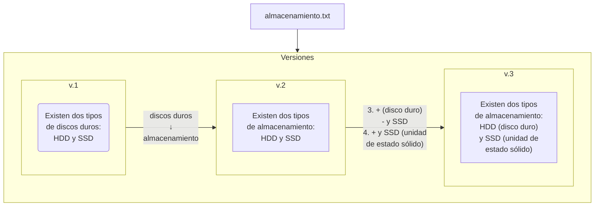

# Control de versiones

El **control de versiones** es la práctica de rastrear y gestionar archivos, directorios y sus respectivos cambios.

## Sistema de control de versiones

Por otra parte, un **sistema de control de versiones** es un programa que nos ayuda a tener un control más práctio y eficiente.

Estos sistemas permiten generan una **base de datos** en la que, por medio de su interfaz, permiten guardar las modificaciones de tus archivos y registrar cada versión.

## Git

**Git** es un **sistema de control de versiones** que, en vez de guardar el archivo completo de cada versión, solo se encarga de guardar los cambios que hay entre las versiones de los archivos. P. ej:

Diagrama del funcionamiento a gran escala de Git

Como puedes observar, **Git** se encarga de guardar los cambios de una versión a otra.

## Binarios en Git

Los **archivos binarios**, a diferencia de los de **texto plano**, son aquellos que, al abrir con el _bloc de notas_ (o cualquier editor de texto plano), aparecen un montón de símbolos raros, lenguaje que entiende la máquina, pero nosotros no. 

> [!IMPORTANT]
>
> Git solo funciona de esta manera con **texto plano.** Si haces esto con un **binario**, tal como un _archivo word_, _no te guardará las modificaciones_, en cambio remplazará "la versión anterior" con la "versión actual"; esto impide que ahorres espacio y que puedas tener un seguimiento tan eficaz tal como un **texto plano**.

En **git** lo ideal sería no trabajar con binarios, sino tenerlos alojados en otro servicio o servidor (e.g. Google Drive). Sin embargo, si es te es necesario trabajar con _binarios en git_, recomiendo utilizar [Git LFS](https://git-lfs.com/) (_Git Long File System_) ya que permite tratar a las imágenes como referencias y con ello reducir el tamaño del repositorio manteniendo el mismo flujo de trabajo.

## Referencias

- [Vega, F.](https://platzi.com/profes/freddier/) (s.f.). _¿Por qué usar un sistema de control de versiones como Git?_. Platzi. https://platzi.com/clases/1557-git-github/19934-por-que-usar-un-sistema-de-control-de-versiones-co/

- Git (s.f.) _1.1 Getting Started - About Version Control_. https://git-scm.com/book/en/v2/Getting-Started-About-Version-Control

- Atlassian (s.f.) _¿Qué es el control de versiones?_ https://www.atlassian.com/es/git/tutorials/what-is-version-control